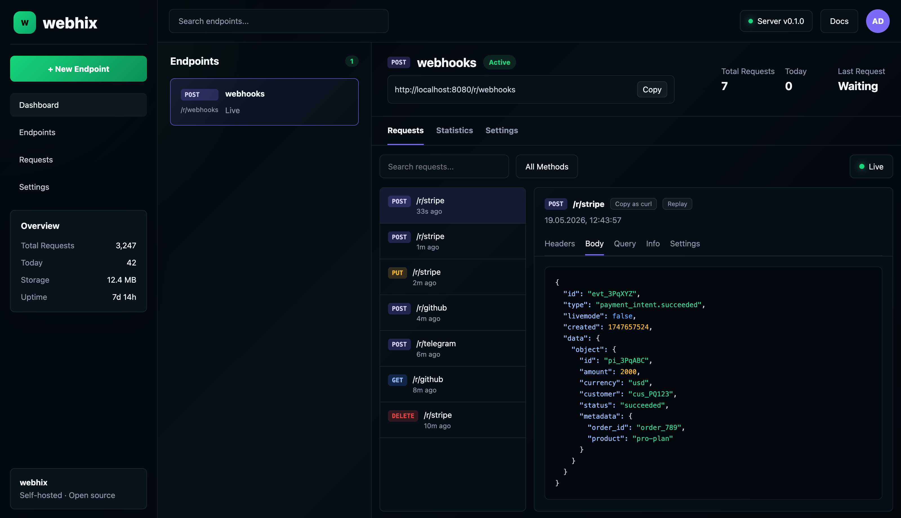

# Webhix

[](https://github.com/gaisbax/webhix/releases)
[](../LICENSE)
[](https://goreportcard.com/report/github.com/gaisbax/webhix)
[](https://github.com/gaisbax/webhix/pkgs/container/webhix)
[](../README.md)
[](CONTRIBUTING.ru.md)

Self-hosted инспектор вебхуков. Один бинарник, SQLite, никаких внешних зависимостей.

webhook.site удобен, но отправляет все данные на чужой сервер. Stripe payload-ы, OAuth-токены, персональные данные — всё это уходит из вашей сети. Многие компании блокируют его по корпоративной политике безопасности. Webhix работает на вашей инфраструктуре и хранит всё локально.



## Возможности

- 📡 Захват любых HTTP-методов — заголовки, тело, query-параметры, IP, время, content-type, размер
- 🔴 Обновление UI в реальном времени через SSE — без перезагрузки страницы
- 🪞 Replay любого запроса одним кликом
- 🎭 Кастомные ответы — настройте статус, заголовки и тело (лёгкий mock-сервер)
- 🔁 Forwarding через CLI: `webhix forward <token> --to localhost:3000`
- 📋 Экспорт как curl — скопируйте любой запрос готовой командой
- 🔍 Полнотекстовый поиск и фильтр по HTTP-методу
- 🔒 Базовая авторизация из коробки
- 🐳 Docker, Compose или standalone бинарник
- 💾 SQLite по умолчанию — Redis и Postgres не нужны

## Почему не webhook.site / smee.io / webhook-tester?

|                  | Webhix         | webhook.site (self-hosted)     | smee.io         | tarampampam/webhook-tester  |
| ---------------- | -------------- | ------------------------------ | --------------- | --------------------------- |
| Self-hosted      | ✅             | ✅                             | ❌              | ✅                          |
| Один бинарник    | ✅             | ❌ PHP + Composer + MySQL      | ❌              | ❌ Redis или fs driver      |
| История запросов | ✅             | ✅                             | ❌              | ✅                          |
| Живой UI         | ✅             | ✅                             | ❌              | ✅                          |
| Replay           | ✅             | ❌                             | ❌              | ❌                          |
| CLI forwarding   | ✅ встроен     | ❌                             | ✅ только это   | ❌ нужен ngrok              |
| Кастомные ответы | ✅             | ❌                             | ❌              | ❌                          |

## Быстрый старт

### Бинарник

```sh
curl -fsSL https://webhix.dev/install.sh | sh
webhix serve --base-url https://hooks.yourdomain.com
```

Или скачайте вручную со страницы [releases](https://github.com/gaisbax/webhix/releases/latest).

### Docker

```sh
docker run -p 8080:8080 -v webhix-data:/data \
  -e WEBHIX_BASE_URL=https://hooks.yourdomain.com \
  ghcr.io/gaisbax/webhix
```

### Docker Compose

```yaml
services:
  webhix:
    image: ghcr.io/gaisbax/webhix
    ports: ["8080:8080"]
    volumes: ["./data:/data"]
    environment:
      WEBHIX_BASE_URL: https://hooks.yourdomain.com
```

### Локальная разработка (без домена)

```sh
webhix serve
# Listening on http://localhost:8080
```

URL endpoint-ов формируется по шаблону `https://<base-url>/r/<token>`.

## Авторизация

Авторизация обязательна. Задайте хотя бы одно из:

```sh
# Пароль для входа через браузер (Basic Auth)
WEBHIX_PASSWORD=yourpassword webhix serve

# Секретный ключ для API и CLI (заголовок Bearer / X-Webhix-Key)
WEBHIX_SECRET_KEY=yourkey webhix serve

# Оба сразу
webhix serve --password yourpassword --secret-key yourkey
```

URL для приёма вебхуков (`/r/<token>`) всегда публичны — авторизация там не нужна.

## Обратный прокси

Работает за Caddy, Nginx, Traefik. Автоматически читает заголовки `X-Forwarded-*`. Укажите `--base-url` или `WEBHIX_BASE_URL` чтобы совпадал с вашим публичным доменом.

## Конфигурация

| Env переменная        | По умолчанию           | Описание                                          |
| --------------------- | ---------------------- | ------------------------------------------------- |
| `WEBHIX_BASE_URL`     | `http://localhost:8080`| Публичный URL для генерации ссылок на endpoint-ы  |
| `WEBHIX_ADDR`         | `:8080`                | Адрес для прослушивания (например `0.0.0.0:9000`) |
| `WEBHIX_DB_PATH`      | `./data`               | Путь к директории с SQLite базой данных           |
| `WEBHIX_PASSWORD`     | —                      | Пароль Basic Auth                                 |
| `WEBHIX_SECRET_KEY`   | —                      | API секретный ключ (Bearer / X-Webhix-Key)        |

## Технические детали

- Написан на Go, собирается в один бинарник
- SQLite по умолчанию, внешняя база не нужна
- UI встроен в бинарник через `go:embed`
- Работает на Linux, macOS, Windows (amd64 + arm64)
- Потребление памяти в простое — менее 50 МБ

## Roadmap

### v0.2

- Мультипользовательский режим с базовым RBAC
- Верификация подписи вебхуков (в стиле Stripe, GitHub)
- Валидация схемы запросов
- Уведомления о новых запросах (Slack, Telegram, Discord)
- Опциональная поддержка Postgres
- Авто-HTTPS через Let's Encrypt (без обратного прокси)

### v0.3+

- Tunnel-режим — подключение к управляемому relay для получения публичного URL без сервера

## Лицензия

[AGPL-3.0](../LICENSE). Self-hosted использование всегда бесплатно и открыто.

Если хотите запустить Webhix как сетевой сервис с закрытыми изменениями — свяжитесь с нами по вопросу коммерческой лицензии.
